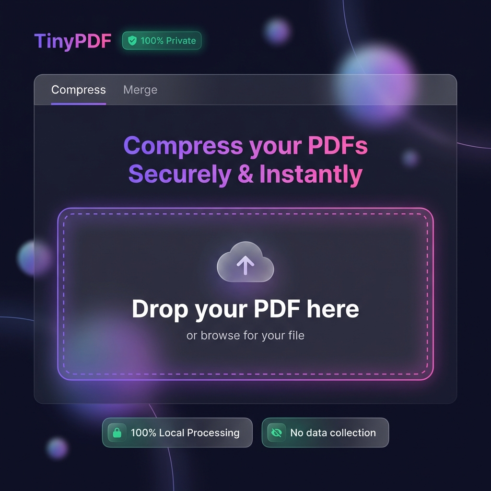

# TinyPDF - PDF Compress & Merge

A **100% client-side** PDF compression and merging tool. Your files never leave your browser - complete privacy guaranteed.

🔗 **Live Demo**: [https://ibrahim-dogan.github.io/pdf-merge-compress/](https://ibrahim-dogan.github.io/pdf-merge-compress/)



## ✨ Features

### 📦 PDF Compression
- **5 preset levels**: Minimal, Low, Medium, High, Maximum
- **Custom settings**: Fine-tune DPI (72-300) and JPEG quality (30-100%)
- Real-time compression with progress indicator
- Shows before/after size comparison

### 🔗 PDF Merge
- Combine multiple PDFs into one
- **Drag-to-reorder** files before merging
- **No quality loss** - original content preserved
- Add/remove files easily

### 🔒 Privacy First
- **100% client-side** - files never uploaded to any server
- Works offline after initial load
- No tracking, no ads, no data collection
- Uses browser's local processing power

## 🛠️ Technology Stack

- **PDF.js** - Mozilla's PDF rendering library
- **jsPDF** - PDF generation from compressed images
- **pdf-lib** - PDF manipulation for merging (lossless)
- **Vanilla JS/CSS** - No frameworks, fast loading

## 🚀 Quick Start

### Option 1: Use Online
Visit [the live demo](https://ibrahim-dogan.github.io/pdf-merge-compress/)

### Option 2: Run Locally
```bash
# Clone the repository
git clone https://github.com/ibrahim-dogan/pdf-merge-compress.git
cd pdf-merge-compress

# Start a local server
python3 -m http.server 8080

# Open in browser
open http://localhost:8080
```

## 📁 Project Structure

```
pdf-merge-compress/
├── index.html      # Compress page
├── merge.html      # Merge page
├── app.js          # Compression logic (PDF.js + jsPDF)
├── merge.js        # Merge logic (pdf-lib)
├── styles.css      # Main styles
└── merge.css       # Merge-specific styles
```

## 🎯 Compression Presets

| Preset | DPI | Quality | Best For |
|--------|-----|---------|----------|
| 💎 Minimal | 200 | 90% | Important documents |
| 🎯 Low | 150 | 85% | General use |
| ⚖️ Medium | 120 | 75% | Email attachments |
| 🚀 High | 96 | 60% | Web uploads |
| 🔥 Maximum | 72 | 50% | Maximum compression |

## ⚠️ Important Notes

- **Compression converts pages to images** - text will no longer be selectable
- Best for scanned documents and image-heavy PDFs
- For text-heavy PDFs, use "Minimal" preset
- **Merge preserves original quality** - no conversion applied

## 📄 License

MIT License - feel free to use and modify.

## 🤝 Contributing

Contributions are welcome! Feel free to open issues or submit pull requests.

---

Made with ❤️ for privacy-conscious users
